# 🎨 프록시 패턴 시각적 가이드

> 프록시 패턴의 동작 원리를 다이어그램과 함께 이해해보세요

## 📋 목차
1. [프록시 패턴 기본 개념](#-프록시-패턴-기본-개념)
2. [정적 프록시 다이어그램](#-정적-프록시-다이어그램)
3. [JDK 동적 프록시 다이어그램](#-jdk-동적-프록시-다이어그램)
4. [CGLIB 프록시 다이어그램](#-cglib-프록시-다이어그램)
5. [프록시 방식 비교표](#-프록시-방식-비교표)
6. [실행 흐름 다이어그램](#-실행-흐름-다이어그램)

---

## 🔍 프록시 패턴 기본 개념

### 프록시 패턴이란?

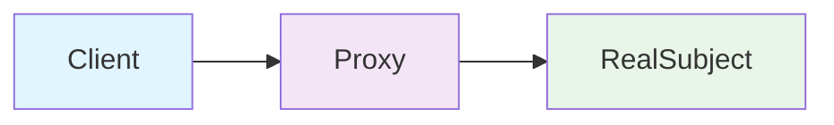

프록시는 **실제 객체에 대한 접근을 제어하는 대리인 역할**을 합니다.

### 프록시가 해결하는 문제들

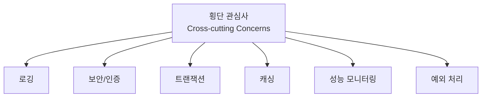

---

## 🔧 정적 프록시 다이어그램

### 클래스 구조

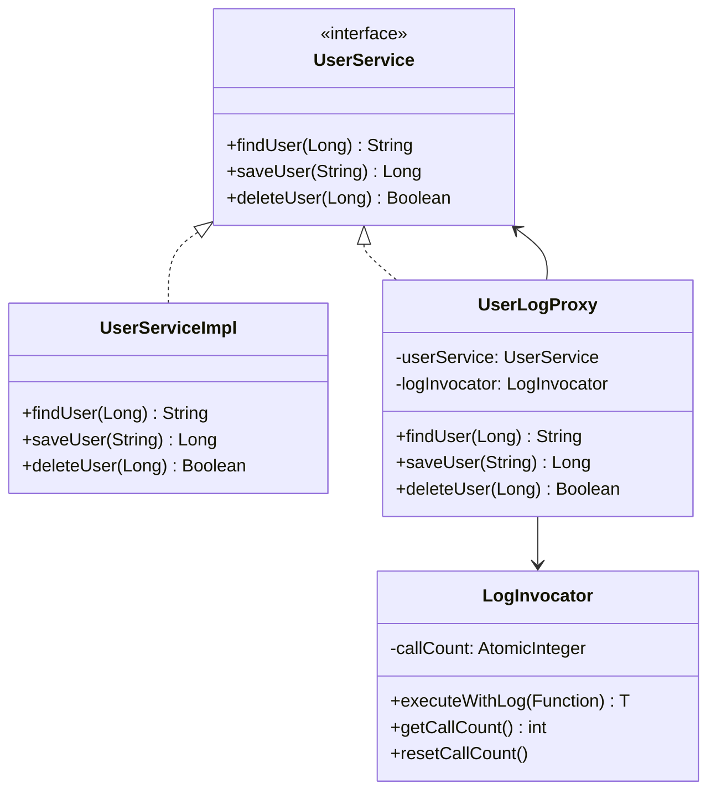

### 실행 흐름

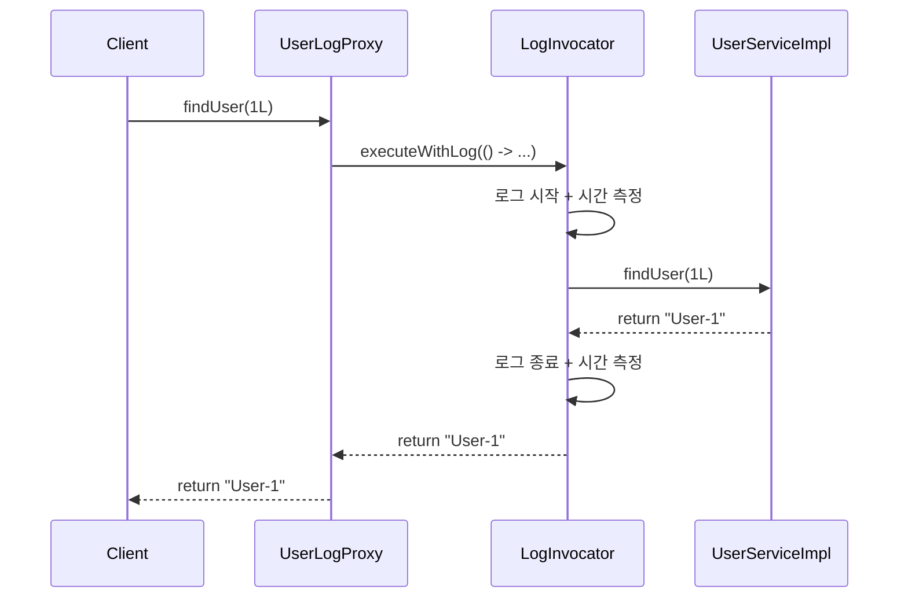

### 정적 프록시의 특징
```
✅ 장점:
- 구조가 단순하고 명확함
- 컴파일 시점에 모든 구조가 결정됨
- 디버깅이 쉬움

❌ 단점:
- 각 클래스마다 프록시 클래스를 직접 작성해야 함
- 코드 중복이 많이 발생
- 횡단 관심사가 여러 클래스에 흩어짐
```

---

## 💫 JDK 동적 프록시 다이어그램

### 런타임 구조

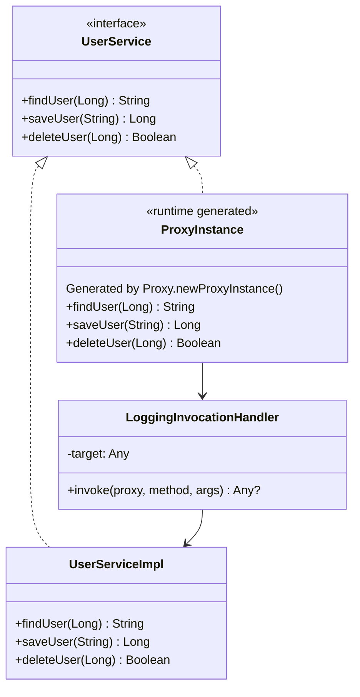

### JDK 동적 프록시 생성 과정

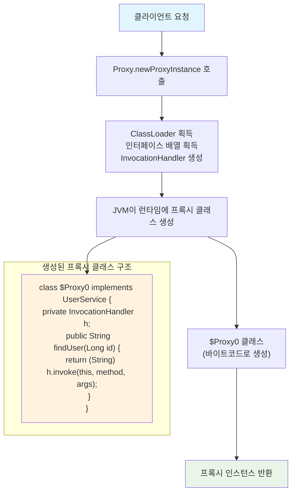

### InvocationHandler 실행 흐름

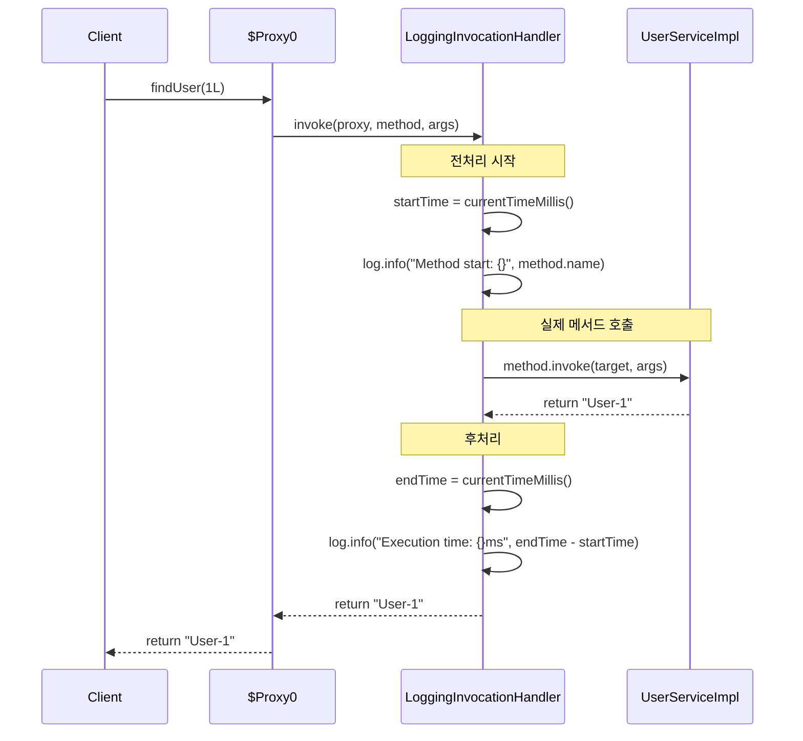

### JDK 동적 프록시 특징
```
✅ 장점:
- JDK 표준 라이브러리 (별도 의존성 불필요)
- 런타임에 프록시 생성 (유연성)
- 하나의 InvocationHandler로 여러 인터페이스 처리 가능

❌ 단점:
- 인터페이스가 반드시 필요
- 리플렉션 사용으로 인한 성능 오버헤드
- 인터페이스 기반이므로 클래스 직접 프록시 불가능
```

---

## 🚀 CGLIB 프록시 다이어그램

### 상속 기반 구조

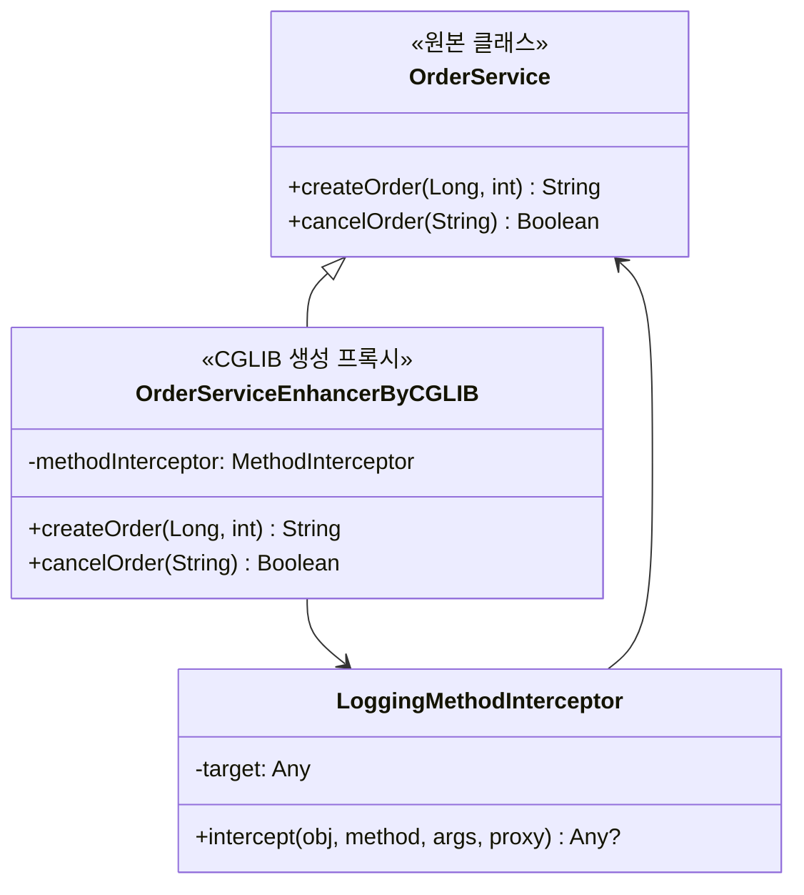

### CGLIB 프록시 생성 과정

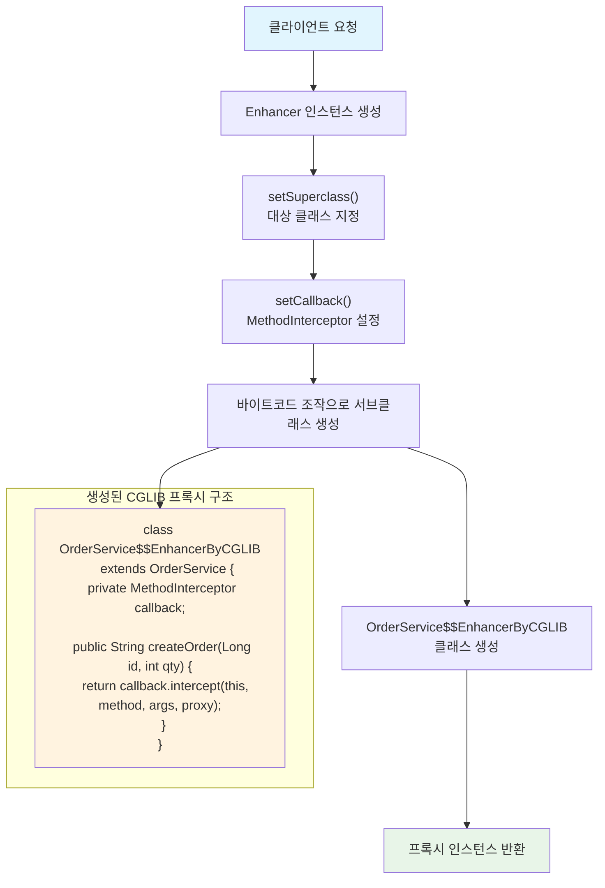

### MethodInterceptor 실행 흐름

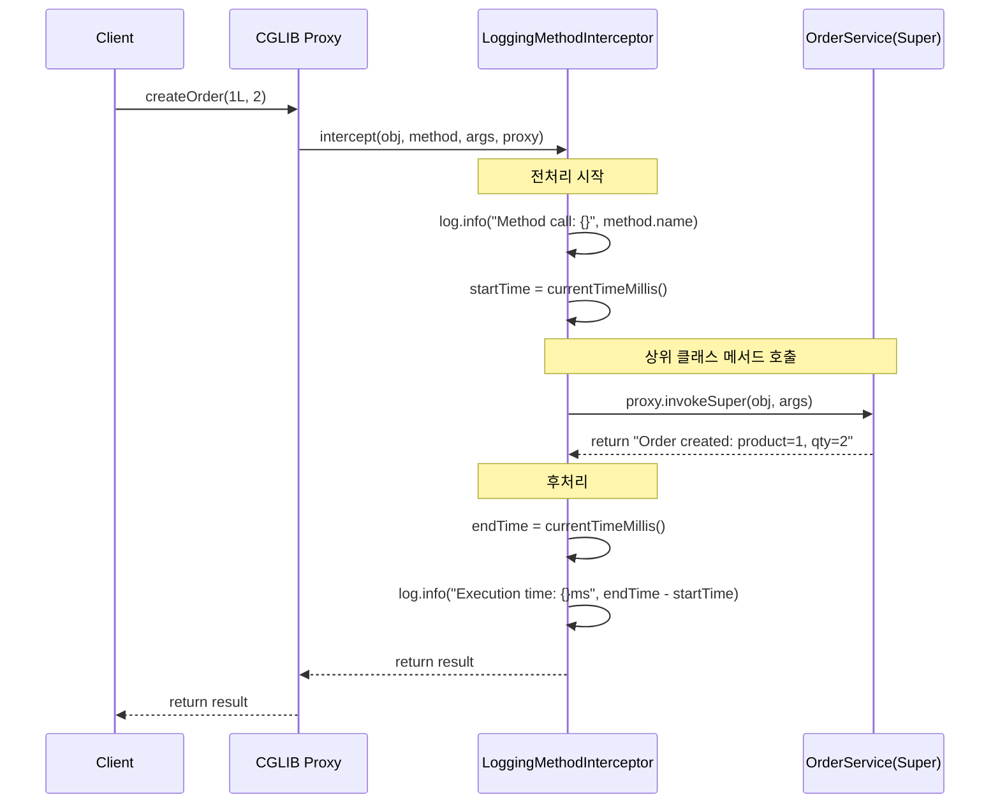

### CGLIB 프록시 특징
```
✅ 장점:
- 인터페이스 없이도 프록시 생성 가능
- 클래스 기반 프록시 (더 유연함)
- Spring에서 기본적으로 사용

❌ 단점:
- 별도 라이브러리 의존성 필요
- final 클래스/메서드는 프록시 불가능
- 바이트코드 조작으로 인한 복잡성
- 기본 생성자가 필요함
```

---

## 📊 프록시 방식 비교표

| 특성 | 정적 프록시 | JDK 동적 프록시 | CGLIB 프록시 |
|------|-------------|----------------|-------------|
| **생성 시점** | 컴파일 시점 | 런타임 | 런타임 |
| **인터페이스 필요** | ✅ | ✅ | ❌ |
| **별도 의존성** | ❌ | ❌ | ✅ |
| **성능** | 가장 빠름 | 중간 | 느림 |
| **메모리 사용량** | 적음 | 중간 | 많음 |
| **final 클래스** | 가능 | 불가능 | 불가능 |
| **final 메서드** | 가능 | 가능 | 불가능 |
| **디버깅 난이도** | 쉬움 | 보통 | 어려움 |
| **코드 유지보수** | 어려움 | 쉬움 | 쉬움 |

---

## 🔄 실행 흐름 다이어그램

### JDK vs CGLIB 실행 흐름 비교

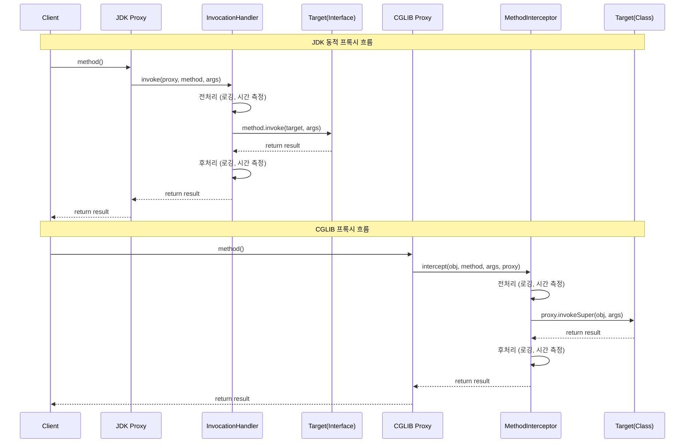

---

## 🎯 Spring에서의 프록시 선택 전략

### Spring AOP 프록시 선택 흐름도

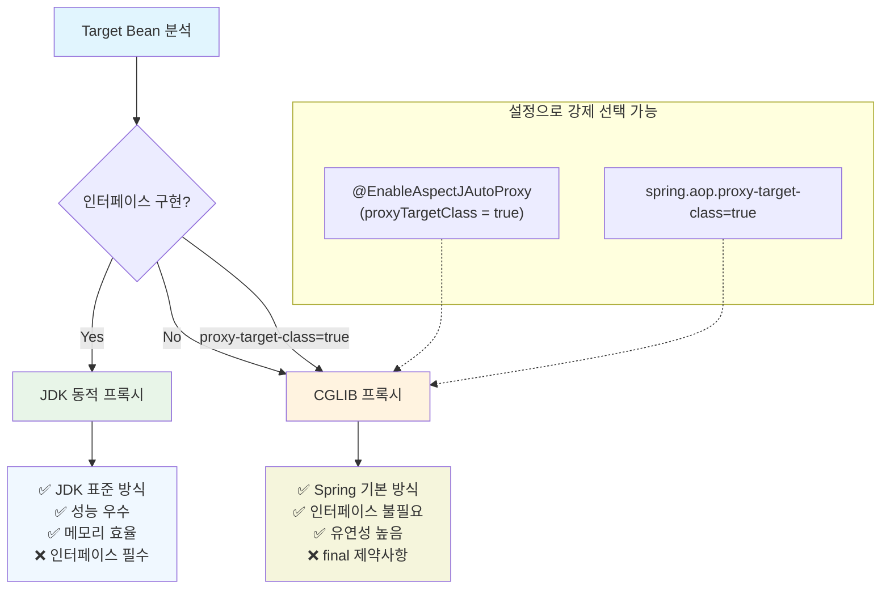

### 설정을 통한 프록시 강제 선택
```kotlin
// application.yml
spring:
  aop:
    proxy-target-class: true  # CGLIB 강제 사용

// 또는 어노테이션
@EnableAspectJAutoProxy(proxyTargetClass = true)
```

---

## 🧪 실습에서 확인할 수 있는 것들

### 1. 프록시 객체 타입 확인
```kotlin
val proxy = createProxy(userService)
println("Proxy class: ${proxy.javaClass.name}")
println("Is JDK Proxy: ${Proxy.isProxyClass(proxy.javaClass)}")
println("Is CGLIB Proxy: ${proxy.javaClass.name.contains("$$")}")
```

### 2. 메서드 호출 횟수 추적
```kotlin
val handler = LoggingInvocationHandler(userService)
val proxy = createProxy(userService, handler)

proxy.findUser(1L)
proxy.findUser(2L)

println("Total method calls: ${handler.getCallCount()}") // 2
```

### 3. 실행 시간 측정
```kotlin
val interceptor = LoggingMethodInterceptor(orderService)
val proxy = createCglibProxy(orderService, interceptor)

val startTime = System.currentTimeMillis()
proxy.createOrder(1L, 5)
val endTime = System.currentTimeMillis()

println("Proxy overhead: ${endTime - startTime}ms")
```

---

## 💡 학습 팁

### 디버깅으로 확인해볼 것들
1. **프록시 객체의 실제 클래스명** - 런타임에 생성된 클래스 확인
2. **메서드 호출 스택** - 프록시 → 핸들러/인터셉터 → 타겟 흐름
3. **메모리 사용량** - 프록시 생성 전후 메모리 비교
4. **리플렉션 호출** - method.invoke() vs proxy.invokeSuper() 차이

### 성능 테스트 예시
```kotlin
@Test
fun `프록시 방식별 성능 비교`() {
    val iterations = 100_000
    
    // JDK 프록시 성능 측정
    val jdkStartTime = System.nanoTime()
    repeat(iterations) { jdkProxy.findUser(1L) }
    val jdkEndTime = System.nanoTime()
    
    // CGLIB 프록시 성능 측정  
    val cglibStartTime = System.nanoTime()
    repeat(iterations) { cglibProxy.createOrder(1L, 1) }
    val cglibEndTime = System.nanoTime()
    
    println("JDK Proxy: ${(jdkEndTime - jdkStartTime) / 1_000_000}ms")
    println("CGLIB Proxy: ${(cglibEndTime - cglibStartTime) / 1_000_000}ms")
}
```

---

**이 시각적 가이드를 통해 프록시 패턴의 동작 원리를 더 명확하게 이해하고, 실습 과정에서 참고하세요! 🎯**